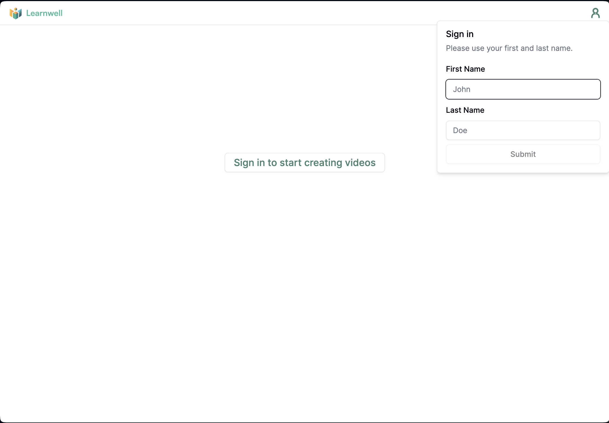
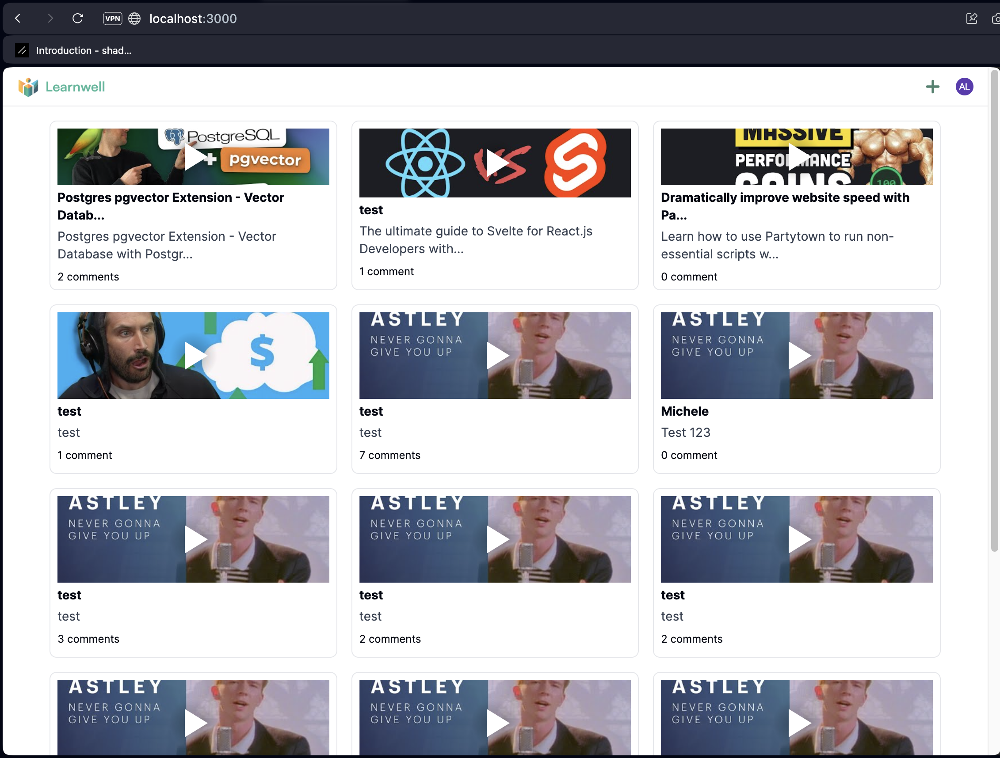
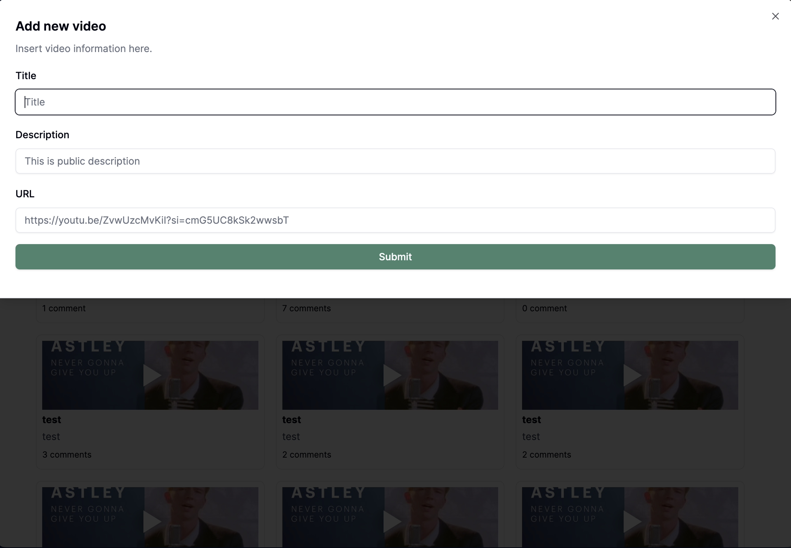
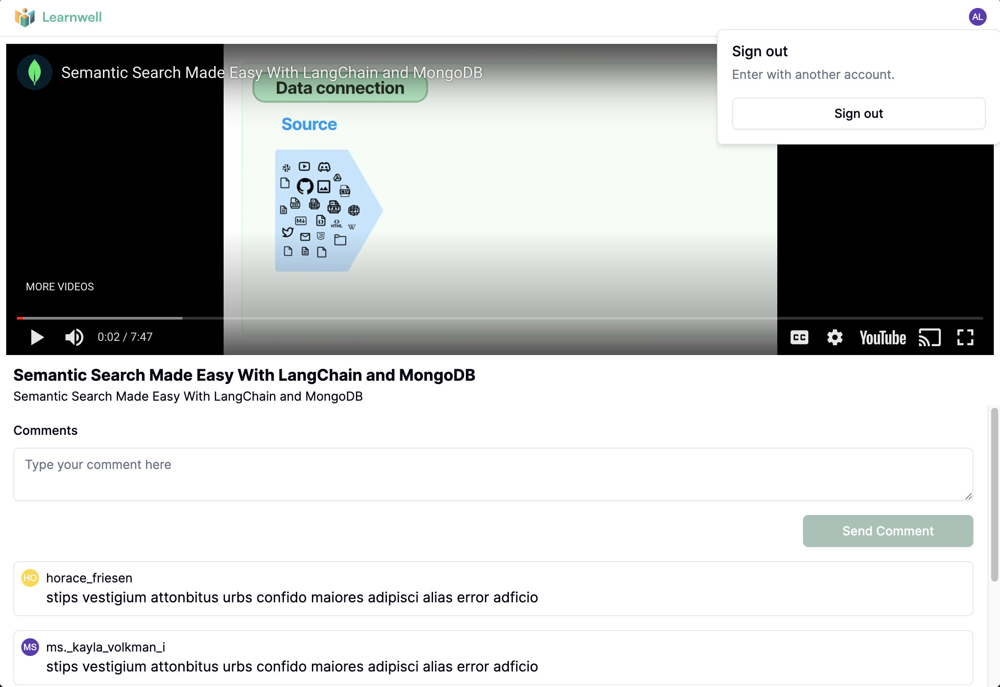

# Learnwell App

## Features

-   **User Authentication**

    -   Log in with your first name and last name.

-   **Video Management**

    -   Query for videos.
    -   Add a new video.

-   **Comments**
    -   Make comments on videos.

## Screenshots

### Login Screen

1. Log in with your first name and last name.

### Video Query

2. Once loogged in, you should see a list with all your saved videos
   

### Add New Video

3. To add a new video, click on the "Add Video" button and fill out the necessary details.
   

### Comments Section

3. Comment on videos by navigating to the video's page and entering your comment in the comments section.
   
