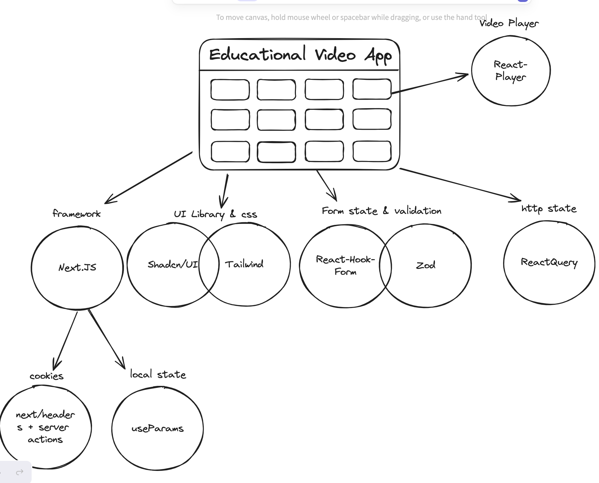

# Project Stack Choice

## Next.js

-   Metaframework for handling React code, navigation, and other browser apis like cookies, search parameters, etc.

## Tailwind & ShadCN/UI

-   For writing elegant css combine with ShadCN/UI library component

## React-Hook-Form & Zod

-   React-Hook-Form for managing forms state, in conjunction with Zod for input validation

## React Query

-   For managing http state, revalidate queries, mutations.
